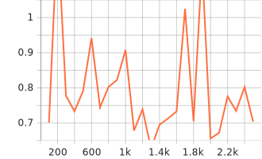

## Project overview

This is the first Self-Driving Car Nano-Degree's project, the goal of the project is understand the
basic concept of object detection using Tensorflow. In the project we:
- Setup the development environment.
- Explore and Analyse the Waymo dataset.
- Split the dataset into ***train***, ***val***, and ***test***.
- Train and evaluate our first model.
- Apply augmentations to the model to improve the algorithm.

In order to fulfil these goals we use Jupyter Notebook, Tensorflow library, and the Tensorboard tool.

This project is hosted in [this Github repository](https://github.com/elros88/object-detection)

## Dataset

We use the ***Waymo dataset*** for this project, In the dataset we identify the type of data
and analyse it before start training our model.
The data was considered to be nominal data and analysed the frequency and percentage of each class inside the data set.
The Exploratory Data Analysis can be found in the notebook '''Exploratory Data Analysis.ipynb'''

## Cross validation

For Cross Validation the dataset was separated in three groups:
- train: 75% of the dataset
- val: 15% of the dataset
- test: 10% of the dataset

The reason to create the thirds group ***test*** was to cross validate if the validation step 
was overfiting the model.

## Training

### Reference experiment
On the reference experiment after 2.5k steps the LOSS values were too high, meaning that the model was underperforming.

### Improve on the reference
To improve the model and reduce the LOSS value several experiments were conducted to implement augmentations gradually
to the model

#### Experiment 0
For the first experiment random black square were introduced to the image of the dataset.
This in order to generate occluded object on the dataset.

The maximum number of black patches that can appears in an images is 25 with a probability equals to 0.4

The LOSS function values decrease considerably.
- ***classification_loss***: train 0.7042 | val 0.7464 
  
- ***localization_loss***: train 0.7561 | val 0.971
  
- ***regularization_loss***: train  23.58 | val 23.58 
  
- ***total_loss***: train 25.04 | val 25.3 
  

#### Experiment 1

In the second experiment ***Gaussian Blur*** was added to simulate fog in the images
Again we can see a decrease on the Total LOSS value.

- ***classification_loss***: train 0.7652 | val 0.7771
  
- ***localization_loss***: train 0.6652 | val 0.867
  
- ***regularization_loss***: train 5.146 | val 5.146 
  
- total_loss: train 6.576 | val 6.79
  

#### Experiemnt 2

In this experiment random changes to the brightness, hue and saturation were introduced to simulate different light 
conditions. 
In this experiment the LOSS value decrease more ending with a total loss around 3

- ***classification_loss***: train 0.6076 | val 0.7041
  
- ***localization_loss***: train 0.5422 | val 0.8022
  
- ***regularization_loss***: train  1.865 | val 1.865 
  
- ***total_loss***: train 3.015| val 3.368
  

#### Experiment 3

In this experiment the augmentations were maintained, and a decrease in the learning rate was introduced from 2500 to 1250,
representing 50% reduction.
In this experiment the total loss value increase from 3.368 to 1848, the learning rate reduction didn't improve the model

- ***classification_loss***: train 1.456 | val 2.119
  
- ***localization_loss***: train 0.6854 | val 0.9178 
  
- ***regularization_loss***: train 1845 | val 1845 
  
- ***total_loss***: train 1847 | val 1848
  

#### Experiment 4

In the last experiment the learning rate was reduces by a half again to see if that reduces the loss value.
The reduction on the learning rate  bring down the total loss value again from 1848 to 41.22, even so, better result 
were found adding occlusion, gaussian filters and hue, brightness, and saturation augmentations to the model

- ***classification_loss***: train 29.14 | val 11.03
  
- ***localization_loss***: train 0.5789 | val 0.9232
  
- ***regularization_loss***: train  29.26 | val 29.26 
  
- ***total_loss***: train 58.99 | val 41.22 
  
